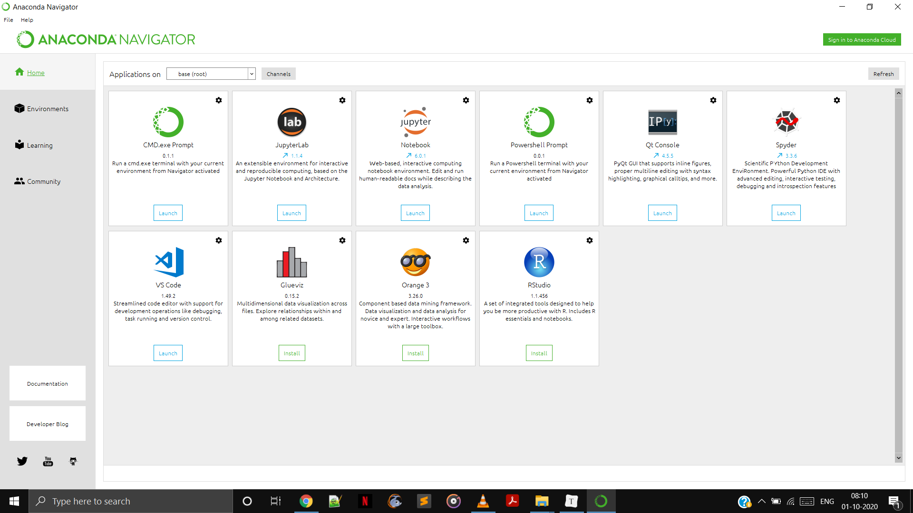
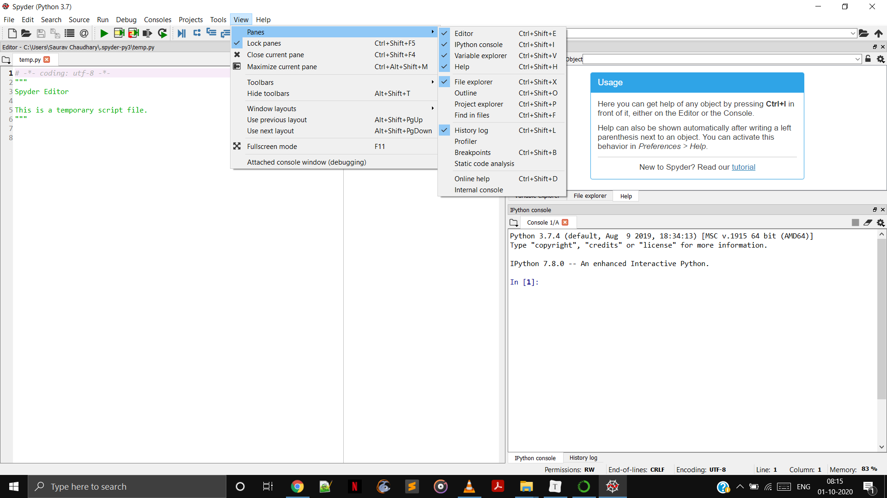
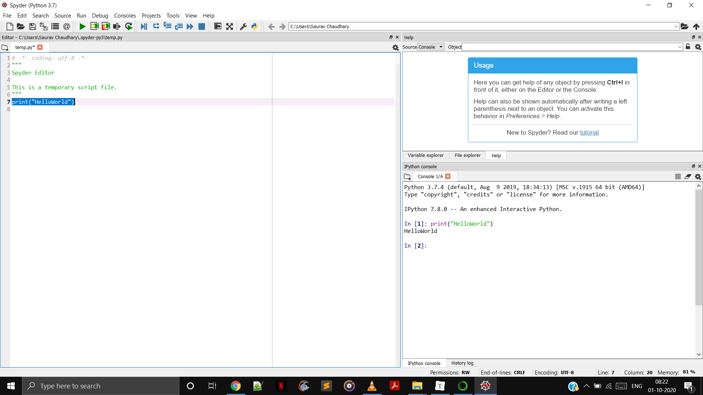

# Installing Python

Doesn't matter it is mac or windows. The process are similar. 

Just Open you browser and type anaconda python or you can simply go to the [link](https://www.anaconda.com/products/individual). Download according to your machine. 

## Anaconda

Python is a programming language that is installed in our machine with that we need some ide to use it in a better and smarter way. Anaconda is the one of the best platform for it. Anaconda has got couples of Ide's.

After download file is downloaded , simply install it and then you can launch it. 

### Launch 

Go to start search bar and search anaconda navigator. You can see that there are couple of things available. 

We are going to use spyder which you can locate on your anaconda screen . Click on launch. A new pop up window will appear which we are going to use. This is our IDE. 

For MAC user you might a blank window. So to adjust pane you can simply follow the below steps shown in image :- 

#### Lets run our first program. 

Simply type the python code. Select the code and press ctrl+Enter on keyboard.

