# Data Preprocessing

A crucial step in the journey of making machine learning model. If there is no data pre-processing your machine learning model wont work properly. **So its similar to like going on a journey.** Suppose you are going on a journey you need to do packing and yes that the boring part but yes also the most important one. Same way is the data pre-processing in machine learning.

##  Get the Dataset

You can download the data set and unzip it in a folder. ClickMe

### About Dataset

###### There is csv file inside the dataset . Open it.

This dataset contains 4 column and 11 rows i.e. 10 Observation. We have to distinguish very important here is independent variable and dependent variable. The country,age & salary column are independent variables. The purchased column is dependent variable.

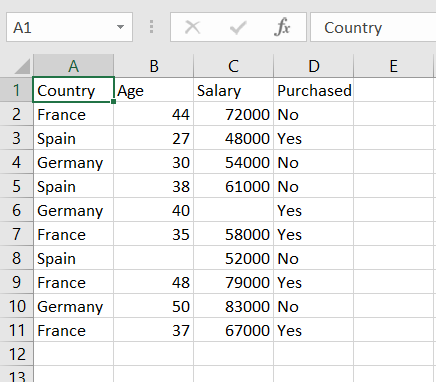

In every machine learning models there are independent variables and dependent variables. We use independent variables to predict dependent variables.


## Import the Libraries

**<u>Launch your Anaconda Navigator and open Spyder.</u>**

We are going to import libraries. A library is a tool to perform specific job . We need to just give the input ,then library will do the task and gives us the output. Without using libraries machine learning . Haha..! Cant be imagined.

There are number of libraries. But here i will only talk about 3 libraries. 

- **<u>Numpy</u>**

  This library contains mathematical tools. So for mathematical operation we need this.

- <u>**MatPlotLib**</u>

  This library is used for plotting datasets.

- **<u>Pandas</u>**

  This library is used to handle or manage datasets.

```python
import numpy as np
import matplotlib.pyplot as plt
import pandas as pd
```

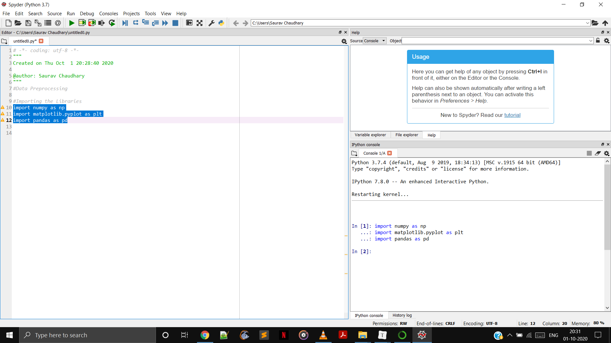


## Importing the Dataset

**<u>Pre-Requisite</u>**

Go the folder containing dataset. Save the dataprocessing.py in the same folder. Run it using the green triangle button on top or a simpler way to do is to press F5.

Use panda to import

```python
#Importing the DataSet
dataset = pd.read_csv('Data.csv')
```

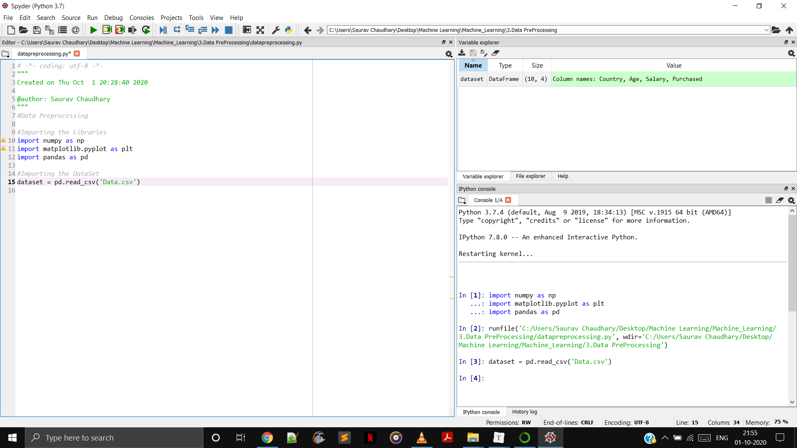

Double click on dataset on to get this table

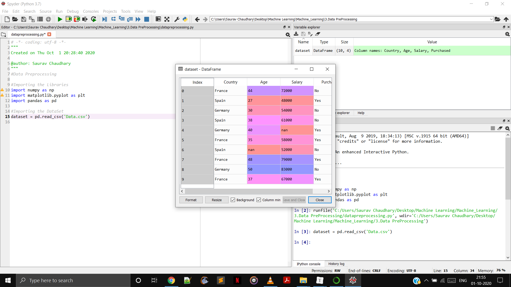

The First Three Column Country ,Age,Salary are independent variables. So we create a vector for them. There are 10 observations.

```python
#Importing the DataSet
dataset = pd.read_csv('Data.csv')
X = dataset.iloc[:,:-1].values
#The First semicolon before comma indicates all the rows and -1 after the comma indicates that we exclude the last column i.e the dependent variable. The .values is the syntax to extract the values.
```

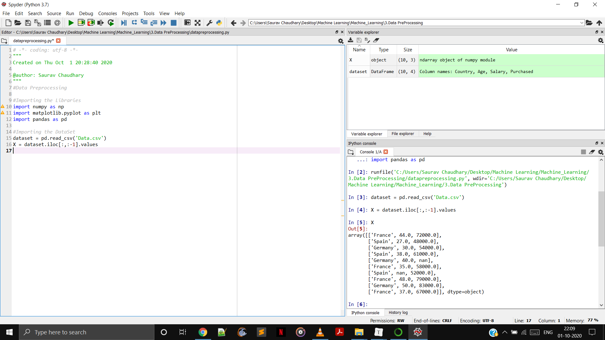

The Last Column represent the independent variable. So to import it

```python
Y = dataset.iloc[:,3].values #The First semicolon before comma indicates all the rows and after comma represents the index.
```

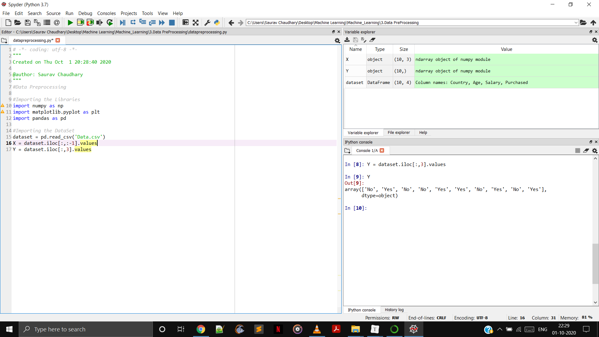


## Missing Data

There are many missing data in the dataset represented by nan. So we need to handle it to make it run correctly. So we can replace the missing data with mean of the data in the column. **This is the mean strategy .** We could do the median strategy or the most repetitive element strategy. 

```python
#Taking care of missing data
from sklearn.preprocessing import Imputer
imputer = Imputer(missing_values ='NaN',strategy="mean",axis=0)
imputer.fit(X[:,1:3])
X[:,1:3]=imputer.transform(X[:,1:3]) #The 1:3 represents the first and second columns
```

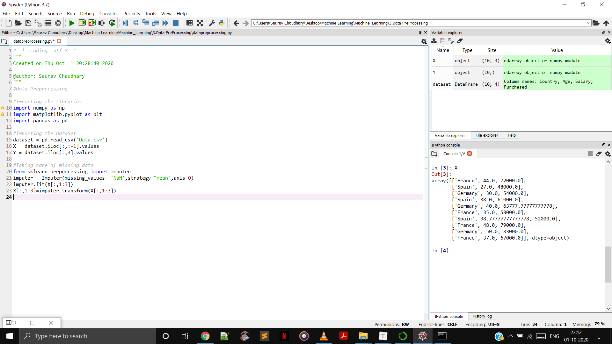


## Categorical Data

**Categorical Variable**

They have certain category. 

Like Country :- France , Spain & Germany

Like Purchased :- Yes,Learn

```python
#Encoding Categorical Data
#We no longer have the value of country written in text its encoded
from sklearn.preprocessing import LabelEncoder
labelencoder_X = LabelEncoder()
X[:,0]=labelencoder_X.fit_transform(X[:,0])
```

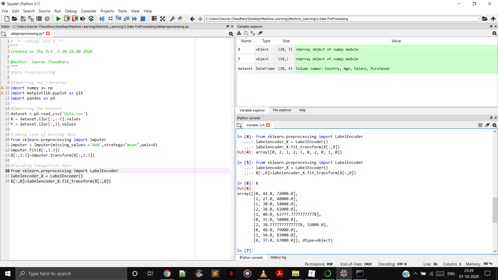

**We replaced the text by numbers but machine learning model uses equation . Since 1 is greater than 0 and so on. So machine learning model will understand spain has a higher value than germany but that is not the case. We cant compare them as there is no relation between them. So we need to prevent machine learning model to assume this.**

So to prevent this we create dummy variable.

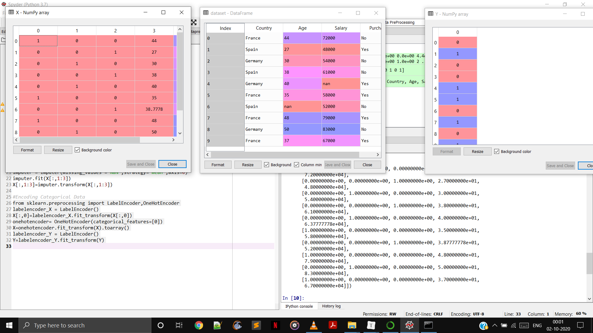


## Splitting the Dataset 

### Into the Training Set & Test Set

##### **Why we need to do this ??**

Because in machine learning we make machine to learn something. So we build two set one on which we train the machine and other on which we test the machine. Performance of machine on test set should be similar to that of training set.

```python
#Spliting the dataset into Training Set and Test Set
from sklearn.model_selection import train_test_split 
X_train,X_test,Y_train,Y_test = train_test_split(X,Y,test_size=0.2,random_state=0)
```

> Here 0.2 test size means out of 10 observation. 2 are there are testing purpose and remaining 8 are there for training purposes. random_state=0 so that we always get the same set of training and testing data.

So now we try to bring a co-relation between the training sets of data.

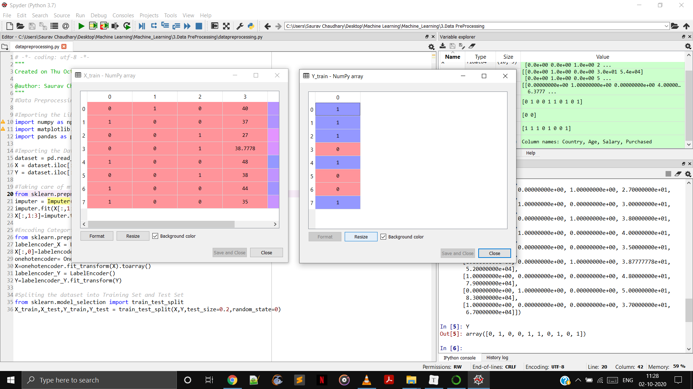

Then we try to do it for testing sets of data.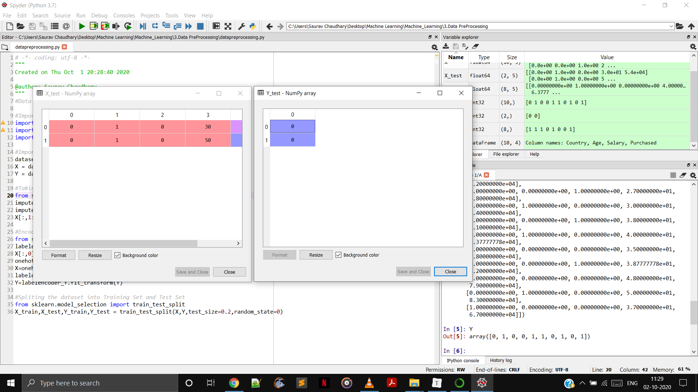

## Feature Scaling

Alot of the machine learning model are based on Euclidean distance. So for the observation given in the csv files. The Euclidean distance will be dominated by the salary because for example if we take two observation.


> So here if we take the observation 9 and 3. 
>
> Then Age  = 21 ,Salary = 31000
>
> Square of them is 441 & 961000000

So these two variables aren't int the same scale and hence salary will dominate the age. 

There are several ways to scale the data :- 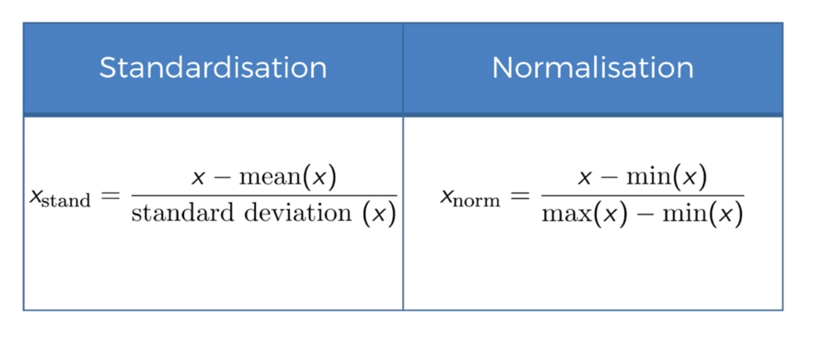

## Data Pre-Processing Template

We already learn how to import libraries , importing the dataset , handling missing data , categorizing data , splitting data and feature scaling.

But in our data pre-processing template. We will keep those which are most frequently in use so i will keep only 

- Importing the Libraries

- Importing the Dataset

- Splitting the Dataset into the Training Set and Test Set

- Feature Scaling but we will keep it commented. Uncomment it when used.

  ```python
  # -*- coding: utf-8 -*-
  """
  Created on Thu Oct  1 20:28:40 2020
  
  @author: Saurav Chaudhary
  """
  #Data Preprocessing
  
  #Importing the Libraries
  import numpy as np
  import matplotlib.pyplot as plt
  import pandas as pd
  
  #Importing the DataSet
  dataset = pd.read_csv('Data.csv')
  X = dataset.iloc[:,:-1].values
  Y = dataset.iloc[:,3].values
  
  #Spliting the dataset into Training Set and Test Set
  from sklearn.model_selection import train_test_split 
  X_train,X_test,Y_train,Y_test = train_test_split(X,Y,test_size=0.2,random_state=0)
  
  """
  #Feature Scaling
  from sklearn.preprocessing import StandardScaler
  #An object of this class
  sc_X = StandardScaler()
  X_train=sc_X.fit_transform(X_train)
  X_test=sc_X.transform(X_test)
  """
  
  ```

Get Complete Code at [datapreprocessingtemplate.py](https://github.com/sauravchaudharysc/Machine_Learning/blob/master/3.Data%20PreProcessing/datapreprocessingtemplate.py)

