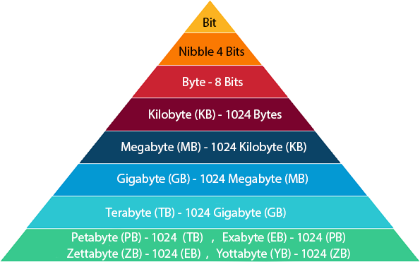
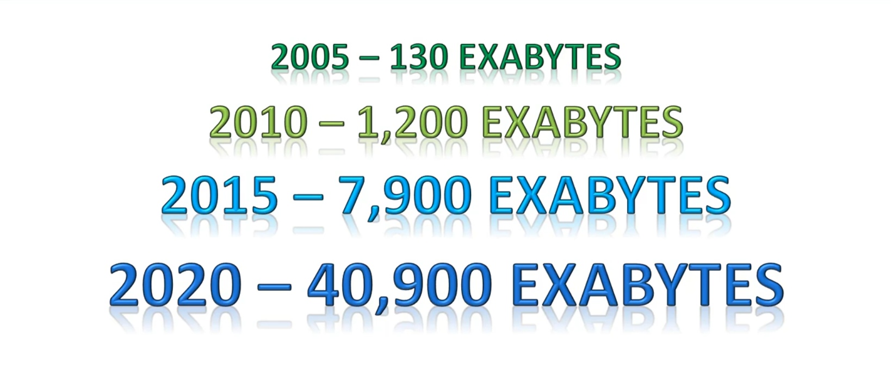

# Machine Learning

“It gives computers the ability to learn without being explicitly programmed”.

Let’s try to understand Machine Learning in layman terms. Consider you are trying to toss a paper to a dustbin.

After first attempt, you realize that you have put too much force in it. After second attempt, you realize you are closer to target but you need to increase your throw angle. What is happening here is basically after every throw we are learning something and improving the end result. We are programmed to learn from our experience.

Suppose that you are watching netflix. Many time you see suggestion coming up there is a section titled “You might also like these movies”. This is a common use case of Machine Learning called “[Recommendation Engine](https://github.com/sauravchaudharysc/Movie-Recommendation-System)”. 

So if you want your program to predict, for example, traffic patterns at a busy intersection (task T), you can run it through a machine learning algorithm with data about past traffic patterns (experience E) and, if it has successfully “learned”, it will then do better at predicting future traffic patterns (performance measure P).

## Applications of Machine Learning

1. Facebook Facial Recognition

2. Play Games With Your Action

3. Virtual Reality Headset

4. Robot Dogs 

5. Ads i.e Facebook,Netflix,Amazon,Flipkart etc

   

## Why Machine Learning is the Future?

We live in the 21st Century wherever we go there is data. The data maybe of the form when your are moving through out the city different antennas are picking you up, going through Facebook, sending a text message etc. Knowingly or Unknowingly data are being generated. It is growing exponentially.

The Data Representation is :-

The growth of data is represented below :- 

We can see in above figure how astonishing it is. The data is growing so quickly i.e exponentially. So machine learning comes into picture here. Only machine learning algorithm can process and bring out some useful result from this large amount of data.
